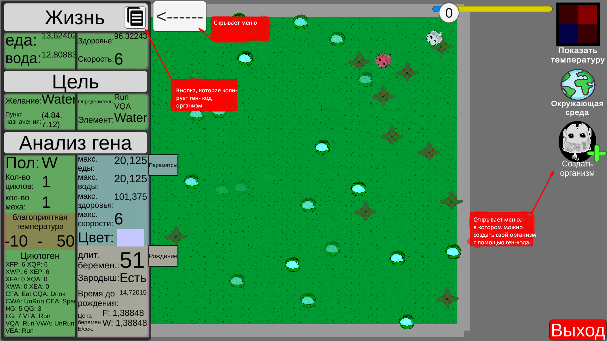
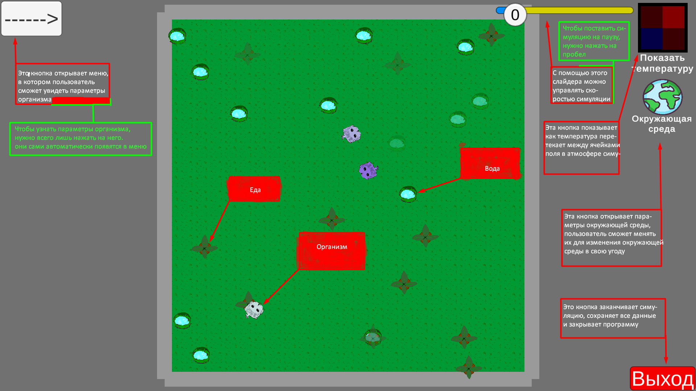
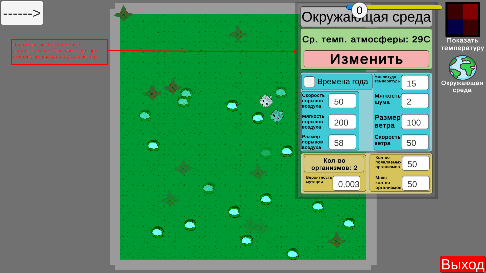
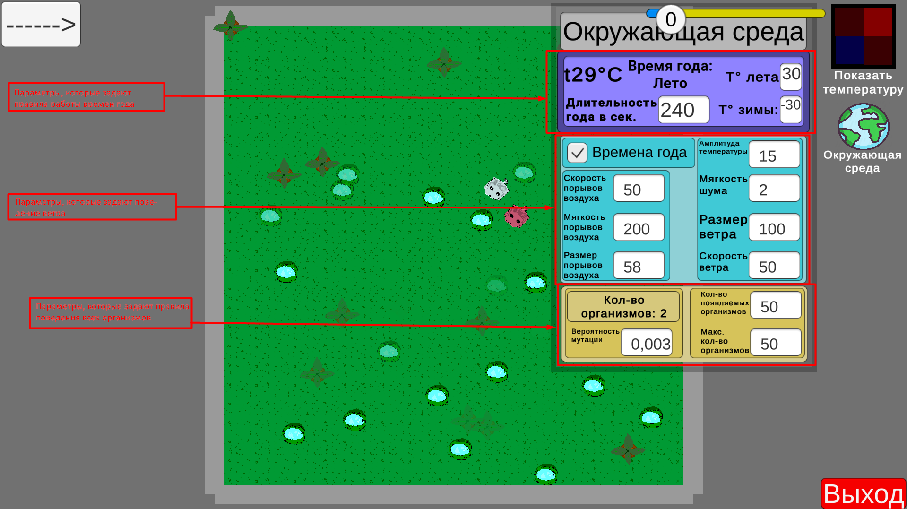
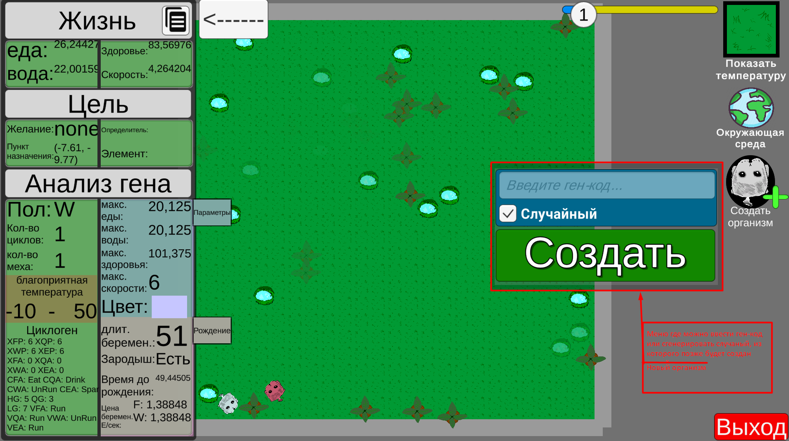
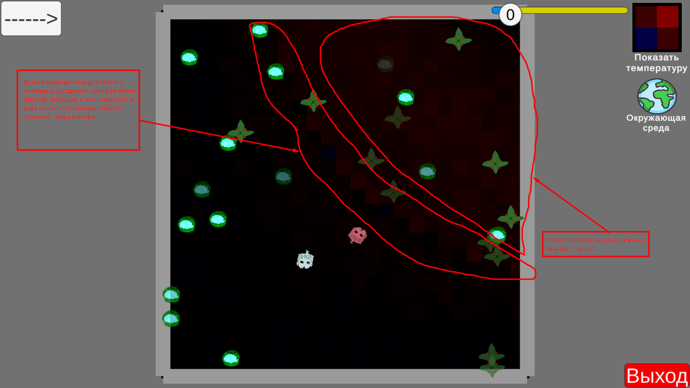

# 🧬 Симулятор естественного отбора и эволюции (Unity / C#)

Индивидуальный учебный проект по моделированию поведения, естественного отбора и мутаций организмов в изменяющейся окружающей среде.

---

## 📌 Основные фичи и возможности

- **Кастомный аналог генетического кода:** Алгоритм кодирования и декодирования признаков организмов (скорость, метаболизм, предпочтения в поведении, размножение).
- **Динамическая окружающая среда:** Система циклов времени года, изменения температуры, порывов ветра и ограниченных ресурсов (еда и вода).
- **Эволюция и естественный отбор:** Проверка гипотез вытеснения видов и приспособляемости организмов в реальном времени.
- **Аналитика и экспорт данных:** Автоматическая фиксация популяции и условий среды с последующей выгрузкой метрик в `.xlsx` (Excel) для построения графиков.

---

## 🛠 Технологический стек

- **Язык:** C#
- **Движок:** Unity
- **Концепции:** ООП, алгоритмы обработки данных, работа с файловой системой и экспортом в Excel

---

## 📸 Скриншоты и материалы
>      

---

## 👤 Автор

- **Габибов Роман Рамилович**
- Студент 2 курса НГТУ им. Р.Е. Алексеева (*Прикладная математика и информатика*)
- GitHub: [@Belxsi](https://github.com/Belxsi)
